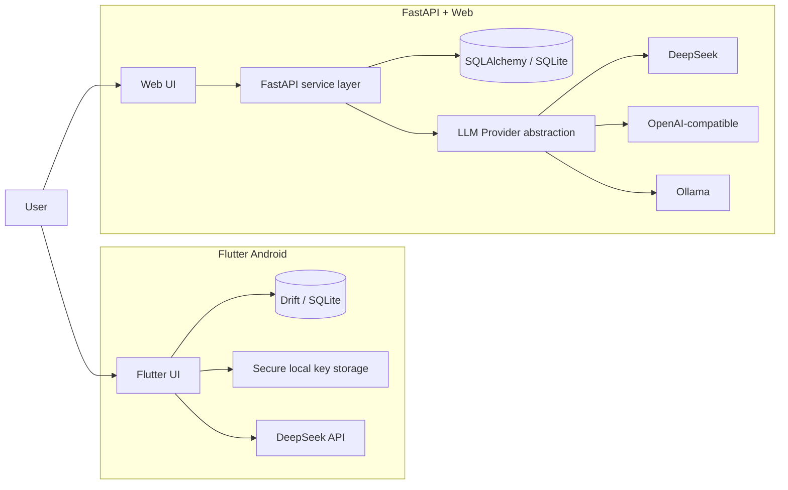

# Night Notes / 夜记

[](LICENSE)


[](https://github.com/joker01-01/night-notes/actions/workflows/ci.yml)

> **What should still work when the AI doesn't?**

Night Notes is a local-first reflection app built around a simple product rule: **the ritual should still work without the model.**

Write a little at night. Once a week, answer one question in your own words. AI can help shape the prompt or echo back a thought, but it is optional.

`Flutter` · `FastAPI` · `SQLite` · `local-first` · `optional LLM` · `tests` · `Docker`

## Why I built it

Many AI apps start with the model and then wrap a UI around it.

I wanted to try the opposite: start with a small product habit, then decide where AI is actually useful.

That led to two constraints:

- **Daily should stay light.** A few sentences, or even just an emotion, then leave.
- **Weekly should carry the weight.** Pick one thing that actually occupied you, answer one question, and keep that record.

The app is for self-reflection and direction-checking. It is not diagnosis, coaching, or therapy.

## What ships today

| Surface | Current state |
| --- | --- |
| Flutter Android trial | Tonight / This week / History / Settings. Drift SQLite on device. Optional DeepSeek. Local fallback when the key or network is unavailable. |
| FastAPI + web prototype | Same dual-track flow in the browser. SQLAlchemy SQLite. Pluggable LLM providers. |

The current trial explicitly does **not** include accounts, cloud sync, push notifications, import/export, or social features.

Product constraints live in [`PRODUCT.md`](PRODUCT.md).

## The reliability idea

The important question for this project is not “how smart is the model?”

It is:

**what happens when the model is unavailable, wrong, or unnecessary?**

Night Notes handles that in a few deliberate ways:

- The core note/history flow works locally.
- Emotion-only entries do not trigger AI.
- Missing API key or network failure falls back to local questions and conservative closing text.
- AI does not write the user's weekly answer for them.
- Secrets stay local.

## Architecture

The Android and FastAPI paths are intentionally different today:



This reflects the code as it exists now:

- **FastAPI backend** — `app/llm/providers.py` abstracts DeepSeek, OpenAI-compatible APIs, and Ollama behind `chat(messages)`.
- **Flutter Android** — currently calls DeepSeek directly. There is no mobile provider switch yet.

## Engineering evidence

- **Local-first storage.** Flutter uses Drift / SQLite; the web prototype uses SQLAlchemy SQLite.
- **Secure local secrets.** Flutter API keys use `FlutterSecureStorage` backed by Android Keystore, with migration away from legacy `SharedPreferences`.
- **Fail-soft behavior.** No key, network failure, or bad model response does not break the core ritual.
- **Prompt/API boundaries.** Tests cover prompt injection / secret leakage and LLM request idempotency.
- **CI.** GitHub Actions runs Python `pytest` and `pip-audit`.
- **Docker stays local.** `docker-compose.yml` binds `127.0.0.1:8000`, avoiding accidental LAN exposure of the unauthenticated local API.
- **Product rules are explicit.** Daily-light / weekly-heavy is documented as a product constraint, not just a UI choice.

## Demo

There is no hosted public demo yet.

- **Web prototype:** run locally at `http://127.0.0.1:8000`
- **Android trial:** build with `flutter build apk --release`

**TODO:** add real product screenshots and a short demo video/GIF.

## Run it

### Web prototype

Python 3.11+.

```bash
python -m venv .venv
# Windows PowerShell
.\.venv\Scripts\Activate.ps1
pip install -r requirements.txt
Copy-Item .env.example .env
uvicorn app.main:app --reload
```

Then open `http://127.0.0.1:8000`.

```bash
pytest
python scripts/demo_review_flow.py
```

Docker support is included through `Dockerfile` and `docker-compose.yml`.

### Android trial

```bash
cd mobile
flutter pub get
dart run build_runner build
flutter run
# or
flutter build apk --release
```

## Design decisions

- **AI does not write the user's answer.** It may propose a weekly question and a short echo; the answer remains the user's own words.
- **BYOK.** The app does not host a shared model quota.
- **Fail-soft over fail-loud.** The nightly ritual should still work when the network does not.
- **Future sync is documented, not implied.** An optional encrypted-sync architecture exists in the docs but is not implemented in the current trial.

## Limitations

- Android trial + local web prototype only. No iOS / desktop client in this repo yet.
- Flutter client is DeepSeek-only; OpenAI-compatible and Ollama providers exist on the FastAPI side only.
- No public screenshots, hosted demo, or store listing yet.
- GitHub Actions does not yet run Flutter tests.
- Cloud sync, notifications, and import/export are out of scope for the current trial.

## License

MIT. See [LICENSE](LICENSE).

<details>
<summary><strong>中文说明</strong></summary>

<br>

> **当 AI 不可用时，产品还应该剩下什么？**

夜记是一款本地优先的反思应用。核心规则很简单：**模型挂了，记录这件事也应该成立。**

每天写一点；每周选一件真正占心力的事，用自己的话回答一个问题。AI 可以帮你提出问题或做很轻的回应，但它不是产品本身。

我做这个项目时刻意从产品习惯出发，再决定 AI 应该放在哪里：

- 日轻：几句话，甚至只有一个情绪，也可以结束。
- 周重：选一件真正重要的事，认真回答一次。
- 没 Key、断网、模型失败时，核心流程继续工作。
- AI 不替用户写答案。
- 数据和密钥尽量留在本地。

当前有 Flutter Android 试用版和 FastAPI + Web 原型。Flutter 使用 Drift / SQLite，本地保存笔记；服务端提供 DeepSeek、OpenAI-compatible、Ollama 的 Provider 抽象。移动端目前仍是直接调用 DeepSeek。

当前最明显的展示短板是没有公开截图和托管 Demo，这一点没有隐藏，后续应优先补真实截图和短演示。

</details>
