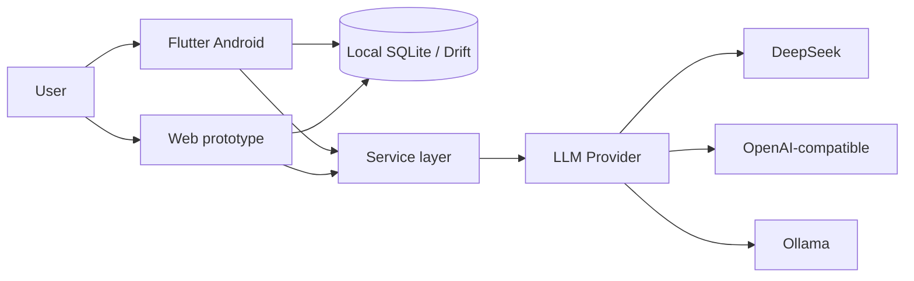

# Night Notes / 夜记

Local-first AI reflection app built with Flutter, FastAPI, and pluggable LLM providers.

**一句话：** 随手记一点，每周问自己一句。AI 是可选能力，不是产品本身。

This repository is a complete local-first AI product, not a chatbot wrapper: on-device storage, optional LLM calls, fail-soft fallbacks, tests, Docker, and a written product constitution.

`中文 / English`

## Demo

There is no hosted public demo yet.

- **Web prototype:** run locally at `http://127.0.0.1:8000`
- **Android trial:** Flutter APK at `mobile/build/app/outputs/flutter-apk/app-release.apk` after `flutter build apk --release`

TODO: add real product screenshots

## Why this exists

Weekly reviews often collapse into “what I did,” while the feeling and weight of the week are already gone.

Night Notes splits the workflow:

- **Daily / light** — a few sentences, or just one emotion. Then leave.
- **Weekly / heavy** — pick one thing that actually occupied you, answer one question in your own words, keep that record.

The product is self-reflection and direction-checking. It is not diagnosis, coaching, or therapy.

## What it does

| Surface | What ships today |
| --- | --- |
| Flutter Android trial | Tonight / This week / History / Settings. Drift SQLite on device. Optional DeepSeek. Local fallback if the key or network is missing. |
| FastAPI + web prototype | Same dual-track flow in the browser. SQLAlchemy SQLite. Pluggable LLM providers. |

Current trial explicitly does **not** include accounts, cloud sync, push notifications, import/export, or social features.

Product rules live in [`PRODUCT.md`](PRODUCT.md).

## Architecture



Local-first: notes stay on the device or in a local database. The model is called only when the user triggers it.

Provider split (what the code actually does):

- **FastAPI backend** — `app/llm/providers.py` abstracts DeepSeek, OpenAI-compatible APIs, and Ollama behind `chat(messages)`.
- **Flutter Android** — talks to `https://api.deepseek.com/chat/completions` with model `deepseek-chat`. No Ollama / OpenAI-compatible switch in the mobile client yet.

## Engineering highlights

- **Product before prompt.** Daily-light / weekly-heavy is a documented constraint, not a UI theme. The old “four questions every night” path is explicitly abandoned.
- **LLM is optional.** No key, network failure, or bad response → local questions and conservative closing text. Emotion-only days do not trigger AI.
- **Provider abstraction on the server.** Business code depends on `chat(messages)`, not a vendor SDK.
- **Secrets stay local.** Flutter API keys use `FlutterSecureStorage` (Android Keystore), with a one-time migration off legacy `SharedPreferences`. Keys are not uploaded.
- **Prompt and API boundaries.** Tests cover prompt injection / secret leakage (`tests/test_prompts.py`, `tests/test_llm_guard.py`) and LLM request idempotency (`app/core/llm_guard.py`).
- **CI.** GitHub Actions runs `pytest` and `pip-audit` on the Python backend. Flutter tests exist under `mobile/test/` but are not in that workflow yet.
- **Docker binds localhost only.** `docker-compose.yml` maps `127.0.0.1:8000` so the unauthenticated local API is not exposed on the LAN.

## Tech stack

| Layer | Stack |
| --- | --- |
| Android | Flutter, Drift / SQLite, `flutter_secure_storage` |
| Backend / web | Python 3.11, FastAPI, SQLAlchemy, APScheduler, vanilla HTML/JS |
| LLM | DeepSeek; OpenAI-compatible and Ollama on the FastAPI side |
| Quality | pytest, Flutter widget/database tests, pip-audit, Docker |

## Getting started

### Web prototype

Python 3.11+.

```bash
python -m venv .venv
# Windows PowerShell
.\.venv\Scripts\Activate.ps1
pip install -r requirements.txt
Copy-Item .env.example .env
uvicorn app.main:app --reload
```

Open [http://127.0.0.1:8000](http://127.0.0.1:8000). First launch creates `data/ai_daily_review.db`. Recording and history work without a key.

```bash
pytest
python scripts/demo_review_flow.py
```

Docker: see `Dockerfile` and `docker-compose.yml`.

### Android trial

```bash
cd mobile
flutter pub get
dart run build_runner build
flutter run
# or
flutter build apk --release
```

## Design decisions

- **AI does not write the user's answer.** It may propose a weekly question and a short echo. The answer must be the user's own words (`PRODUCT.md`).
- **BYOK.** The user brings a key; the app does not host a shared model quota.
- **Fail-soft over fail-loud.** The nightly ritual has to work when the network does not.
- **Publish architecture is documented,** including a later optional end-to-end encrypted sync path that is **not implemented** in this trial. See `docs/decisions/2026-07-31-publish-architecture.md`.

## Limitations

- Android trial + local web prototype only. No iOS / desktop client in this repo yet.
- Flutter client is DeepSeek-only; Ollama / OpenAI-compatible providers are on the FastAPI side.
- No public screenshots, hosted demo, or published store listing.
- GitHub Actions does not yet run Flutter tests.
- Cloud sync, notifications, and import/export are out of scope for the current trial.

## Status

| Track | Status |
| --- | --- |
| Daily (light) | Shipped in trial |
| Weekly (heavy) | Shipped in trial |
| Flutter Android MVP | Shippable to a small private trial |
| Accounts / sync / notifications | Not in this version |

## Repository layout

```text
.
├── app/                 # FastAPI: API, services, LLM providers, web UI
├── mobile/              # Flutter Android trial
├── tests/               # Python tests
├── docs/                # Product constitution, ADRs, trial guide
├── PRODUCT.md           # Product rules
├── Dockerfile
└── docker-compose.yml
```

## License

MIT. See [LICENSE](LICENSE).
