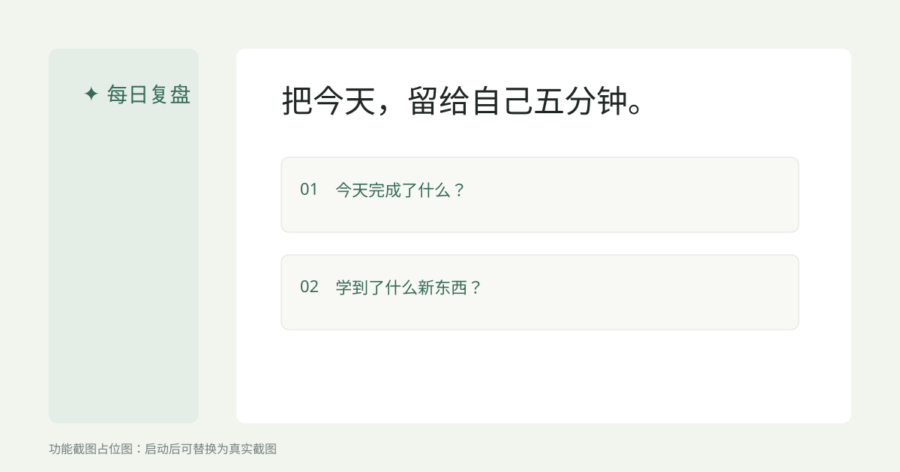

# 夜记（日轻 · 周重）

本地优先的中文自我复盘工具：平日留下今天最想记住的一点，周日在痕迹仍热时问自己一句「这件事对你是什么感觉/分量」。

> **产品定位与原则以 [`PRODUCT.md`](PRODUCT.md) 为准。**  
> 改功能 / 改 UI / 改文案前先读它，避免定位漂移。

**一句话介绍：** 平时五分钟随手记；周日用近七日痕迹生成一个温柔周问，作答后极短收束。  
**核心差异：** 别人的 AI 周记总结「做了什么」；我们留下当时感，用来校正方向、少走弯路。

> Web 原型默认将夜记、设置与本地归档写入本机 SQLite；Flutter 移动端写入设备本地存储。  
> 只有你主动触发 AI（可选自问、日收束、周问、周收束）时，才会把**当时所需**的上下文发送到你选择的 LLM API。



## 现状与路线

| 轨道 | 状态 | 说明 |
|------|------|------|
| **日（轻）** | 已可用 | 自由书写 → 存一下/先这样；可选「再问自己一句」与短收束。**每日四问制已废案。** |
| **周（重）** | 已可用 | 近七日痕迹 → 问自己一句（本周）→ 作答 → 极短收束；核心资产是周问+回答 |

### Flutter Android MVP

移动端当前已完成第一版可运行闭环：

- **今晚：** 写下今天最想留下的一点，不要求完整日记；保存到本机后即可离开。
- **本周：** 有日痕迹时用痕迹生成周问；没有痕迹时可用“最近最想搞清楚的一件事”起步。
- **AI：** 设置 DeepSeek API Key 后，周问真实调用 DeepSeek；网络或 API 失败时使用本地问题兜底。
- **本地：** 日记、周记与 Key 当前保存在设备本地；正式发布前 Key 需迁移到 Android Keystore。

> **发布路线（2026-07-31）：** Flutter 全平台重写；本地优先 + 可选端到端加密同步；BYOK 设备端直连 AI；免费核心 + 同步订阅（许可证码）。详见 [PRODUCT.md](PRODUCT.md) 与 [docs/decisions/2026-07-31-publish-architecture.md](docs/decisions/2026-07-31-publish-architecture.md)。

硬规则见 `PRODUCT.md`：**当时感不可事后补全**；**每日四问制已废案**；长提纲与重对话只属于周场。

## 功能（当前代码）

- 导航：今晚 / 本周 / 回看 / 设置。
- 今晚：自由书写；AI 默认关；可选自问与可选收一收。
- 本周：七日格 + 痕迹；有日痕迹时生成一个温柔周问 → 作答落库 → 短收束（echo / next_focus / note）。首次使用也可用“最近最想搞清楚的一件事”直接起步。
- 回看：日历归档；旧四问历史兼容可读；新数据展示自由写 / 周问答。
- APScheduler 每日定时创建「今晚正文」占位会话（默认 21:00，Asia/Shanghai），**不再出四道固定题**。
- LLM Provider：DeepSeek、OpenAI 兼容 API、Ollama；Prompt 在 `app/llm/prompts.py`。

## 项目结构

```text
.
├── app/
│   ├── api/             # FastAPI 路由与 HTTP 边界
│   ├── core/            # pydantic-settings 配置、SQLAlchemy 连接
│   ├── llm/             # Provider 抽象 + prompts
│   ├── models/          # DailySession / QA / Summary / Settings / WeeklyReview
│   ├── notifier/        # 通知抽象，当前为 Web 提醒
│   ├── scheduler/       # APScheduler 每日任务
│   ├── services/        # 日场、周场、设置、痕迹聚合
│   ├── static/          # 原生 HTML/CSS/JS 前端
│   └── main.py
├── mobile/                 # Flutter Android MVP
├── tests/
├── scripts/
├── config.yaml
├── .env.example
├── PRODUCT.md           # 产品定位与设计原则（宪法）
├── CHANGELOG.md
├── PROGRESS.md
└── TODO.md
```

## 快速开始

要求 Python 3.11+。

```bash
python -m venv .venv
# Windows PowerShell
.\.venv\Scripts\Activate.ps1
pip install -r requirements.txt
Copy-Item .env.example .env
uvicorn app.main:app --reload
```

浏览器打开 [http://127.0.0.1:8000](http://127.0.0.1:8000)。首次启动会创建 `data/ai_daily_review.db`。未填 Key 也可记录与回看；需要 AI 时再在设置页配置模型。

```bash
pytest
python scripts/demo_review_flow.py
```

## Docker

见仓库内 `Dockerfile` 与 `docker-compose.yml`（默认仅绑定本机）。

## 数据与隐私

- Web 原型使用本地 SQLite；Flutter 端使用设备本地存储。API Key 当前只保存在本机（移动端正式发布前迁移到系统 Keychain/Keystore），Key 永不上云。
- 日痕迹供周场消费；周问+回答是周场核心资产。

## 许可

MIT。详见 [LICENSE](LICENSE)。
